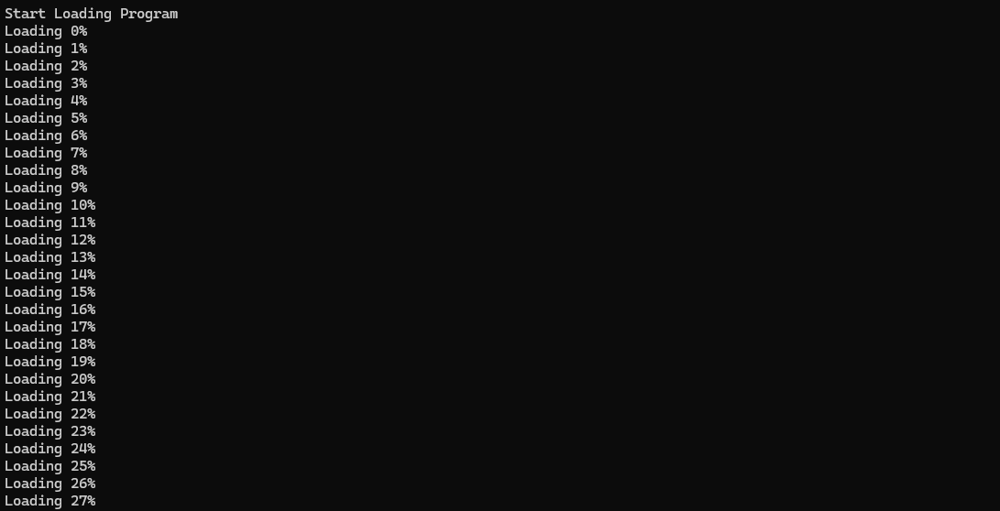
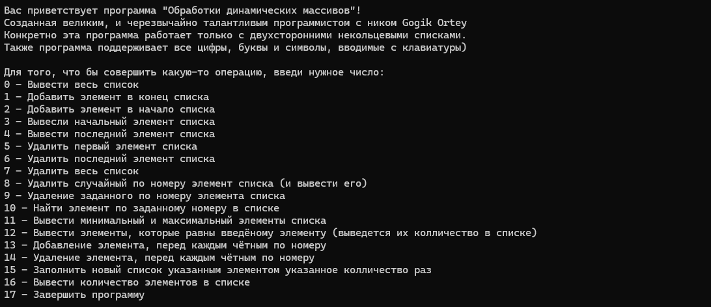

### Многомерные списки - проект из университета

Это программа по управлению двунаправленным некольцевым списком. Фактически, это реализация структуры List, из стандартных пакетов большинства языков  
Также были реализованы дополнительные методы, которые были в задании преподавателя

Это проект с 1го курса университета, 2021 года

Программа написана на Паскале, и может быть запущена через .exe файл

Скриншоты:

